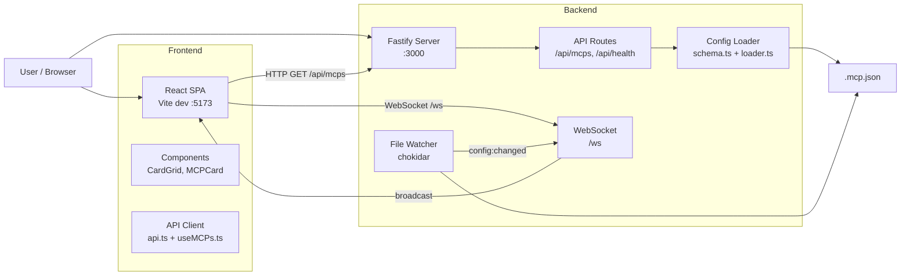

# Architecture: Weir

## Flow Diagram



## Backend Components

### `src/config/schema.ts`
Schema Zod do .mcp.json. Aceita dois formatos de entrada:

- **Flat**: `type`, `command`, `args`, `url` no nivel do servidor
- **Nested**: `transport` com `type`, `command`, `args`, `url` aninhados

Usa `z.preprocess()` para normalizar o formato flat para nested internamente, garantindo que toda a logica downstream trabalhe com um formato unificado.

### `src/config/types.ts`
Tipos TypeScript inferidos do schema Zod via `z.infer`. Define `MCPClient` com `name`, `transport`, `command?`, `args?`, `url?` e `TransportKind` (`stdio | http | sse | unknown`).

### `src/config/loader.ts`
Le, faz parse e valida o .mcp.json. Retorna `LoadResult` com `clients: MCPClient[]` e `error: string | null`. Lida com: arquivo inexistente, JSON invalido, schema invalido.

### `src/config/watcher.ts`
Monitora o .mcp.json com chokidar. Dispara callback quando detecta alteracoes no arquivo. Usado para notificar o WebSocket apos cada modificacao.

### `src/api/mcp.routes.ts`
`GET /api/mcps` — retorna lista de servidores MCP configurados. Usa o loader para ler o arquivo a cada requisicao (leitura sob demanda para dados sempre atualizados).

### `src/api/health.routes.ts`
`GET /api/health` — healthcheck simples do servidor.

### `src/api/ws.ts`
WebSocket handler. Mantem um Set de conexoes ativas. Oferece `broadcast(event, data)` para notificar todos os clientes conectados quando o .mcp.json e alterado.

### `src/index.ts`
Entry point. Inicializa Fastify com CORS, WebSocket, rotas, static files e o file watcher. Le `MCP_CONFIG_PATH` do ambiente para localizar o .mcp.json.

## Frontend Components

### `src/components/MCPCard.tsx`
Card individual de um servidor MCP. Exibe nome, tipo de transporte (com badge colorido), comando/URL.

### `src/components/CardGrid.tsx`
Grid responsivo de 3 colunas. Renderiza lista de MCPCard ou EmptyState/ErrorState.

### `src/components/EmptyState.tsx`
Exibido quando nenhum .mcp.json encontrado ou sem servidores configurados.

### `src/components/ErrorState.tsx`
Exibido quando o .mcp.json esta mal formatado ou ha erro de leitura.

### `src/services/api.ts`
Cliente HTTP + WebSocket. Fetch para `GET /api/mcps`, conexao WebSocket em `/ws` para receber eventos `config:changed`.

### `src/hooks/useMCPs.ts`
Hook TanStack React Query que gerencia o estado dos MCPs. Escuta eventos WebSocket para refetch automatico quando o .mcp.json e alterado.

## Schema do .mcp.json

O Weir aceita dois formatos, que podem coexistir no mesmo arquivo.

### Formato Flat (recomendado)

```json
{
  "mcpServers": {
    "filesystem": {
      "type": "stdio",
      "command": "npx",
      "args": ["-y", "@modelcontextprotocol/server-filesystem", "/tmp"]
    },
    "weather-api": {
      "type": "http",
      "url": "https://api.weather.example/mcp"
    },
    "db-stream": {
      "type": "sse",
      "url": "https://db.internal/mcp/sse"
    }
  }
}
```

### Formato Nested (transport wrapper)

```json
{
  "mcpServers": {
    "filesystem": {
      "transport": {
        "type": "stdio",
        "command": "npx",
        "args": ["-y", "@modelcontextprotocol/server-filesystem", "/tmp"]
      }
    },
    "weather-api": {
      "transport": {
        "type": "http",
        "url": "https://api.weather.example/mcp"
      }
    }
  }
}
```

### Validacoes

- `mcpServers` e obrigatorio (objeto, pode ser vazio)
- stdio requer `command` (string)
- http/sse requer `url` (URL valida)
- Tipos desconhecidos sao exibidos como "Desconhecido"

## Fluxo de Atualizacao Automatica

```
1. Weir inicia
2. loader.ts le .mcp.json
3. watcher.ts comeca a monitorar o arquivo
4. GET /api/mcps → lista inicial de MCPs
5. Browser conecta WebSocket /ws
6. Usuario edita .mcp.json ↓
7. watcher.ts detecta alteracao
8. Callback → ws.ts broadcast('config:changed')
9. Browser recebe evento
10. useMCPs.ts faz refetch de GET /api/mcps
11. CardGrid re-renderiza com dados atualizados
```

Tempo entre edicao e reflexao na tela: <5s (CS-002).
